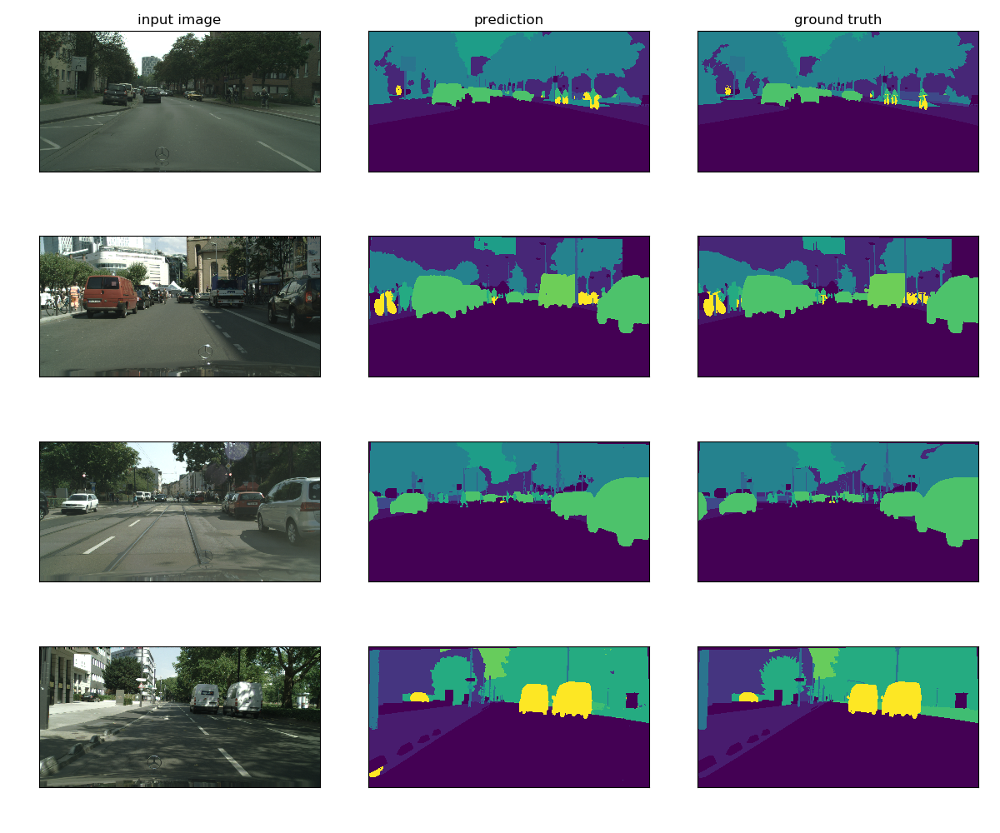

# PytorchSegmentation
This repository implements general network for semantic segmentation.  
You can train various networks like DeepLabV3+, PSPNet, UNet, etc., just by writing the config file.



## Pretrained model
You can run pretrained DeepLabv3+ converted from [official tensorflow model](https://github.com/tensorflow/models/blob/master/research/deeplab/g3doc/model_zoo.md).  
Currently I checked that xception65_cityscapes_trainfine can be converted.

```
$ mkdir tf_model
$ cd tf_model
$ wget http://download.tensorflow.org/models/deeplabv3_cityscapes_train_2018_02_06.tar.gz
$ tar -xvf deeplabv3_cityscapes_train_2018_02_06.tar.gz
$ cd ../src
$ mkdir ../model
$ python convert.py ../tf_model/deeplabv3_cityscapes_train/model.ckpt 19 ../model/cityscapes_deeplab_v3_plus/model.pth
```

Then you can test the performance of trained network.

```
$ python eval.py
```


## How to train
In order to train model, you have only to setup config file.  
For example, write config file as below and save it as config/pascal_unet_res18_scse.yaml.

```yaml
Net:
  enc_type: 'resnet18'
  dec_type: 'unet_scse'
  num_filters: 8
  pretrained: True

Data:
  dataset: 'pascal'
  preprocess: 'imagenet'
  target_size: (256, 256)

Train:
  max_epoch: 20
  batch_size: 2
  resume: False
  start_epoch: 0

Loss:
  weight:
  size_average: True
  batch_average: True

Optimizer:
  mode: 'adam'
  base_lr: 0.001
  t_max: 10
```

Then you can train this model by:

```
$ python train.py ../config/pascal_unet_res18_scse.yaml
```

## Dataset
- Cityscapes
- Pascal Voc
    - augmentation
        - http://home.bharathh.info/pubs/codes/SBD/download.html
        - https://github.com/TheLegendAli/DeepLab-Context/issues/10

## Directory tree
```
.
├── config
├── data
│   ├── cityscapes
│   │   ├── gtFine
│   │   └── leftImg8bit
│   └── pascal_voc_2012
│        └── VOCdevkit
│            └── VOC2012
│                ├── JPEGImages
│                ├── SegmentationClass
│                └── SegmentationClassAug
├── logs
├── model
└── src
    ├── dataset
    ├── logger
    ├── losses
    │   ├── binary
    │   └── multi
    ├── models
    │   └── inplace_abn
    └── utils
```

## Environments
- OS: Ubuntu18.04
- python: 3.6.4
- pytorch: 0.4.1


## Reference

### Encoder
- https://arxiv.org/abs/1505.04597
- https://github.com/tugstugi/pytorch-saltnet

### Decoder
#### SCSE
- https://arxiv.org/abs/1803.02579

#### IBN
- https://arxiv.org/abs/1807.09441
- https://github.com/XingangPan/IBN-Net
- https://github.com/SeuTao/Kaggle_TGS2018_4th_solution

#### OC
- https://arxiv.org/abs/1809.00916
- https://github.com/PkuRainBow/OCNet

#### PSP
- https://arxiv.org/abs/1612.01105

#### ASPP
- https://arxiv.org/abs/1802.02611

### Ohter
#### inplaceABN
- https://arxiv.org/abs/1712.02616
- https://github.com/mapillary/inplace_abn
